# Demo

## Verify we're working on a clean setup

First, notice there are no VPC Flow Logs configured yet.

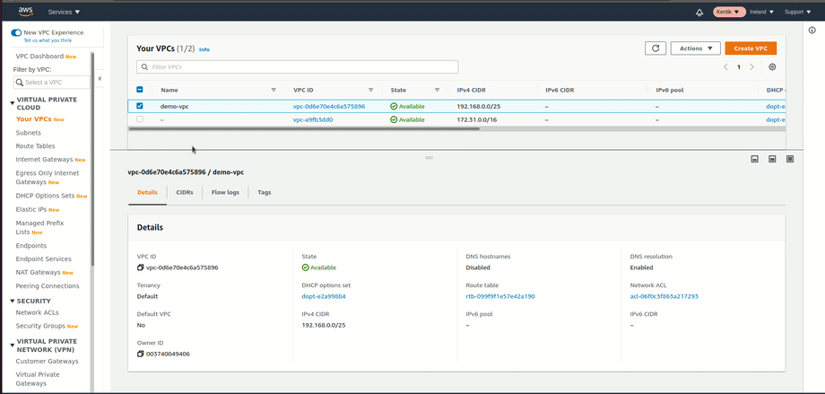

Next, check the CloudFormation stacks. None are ready yet.

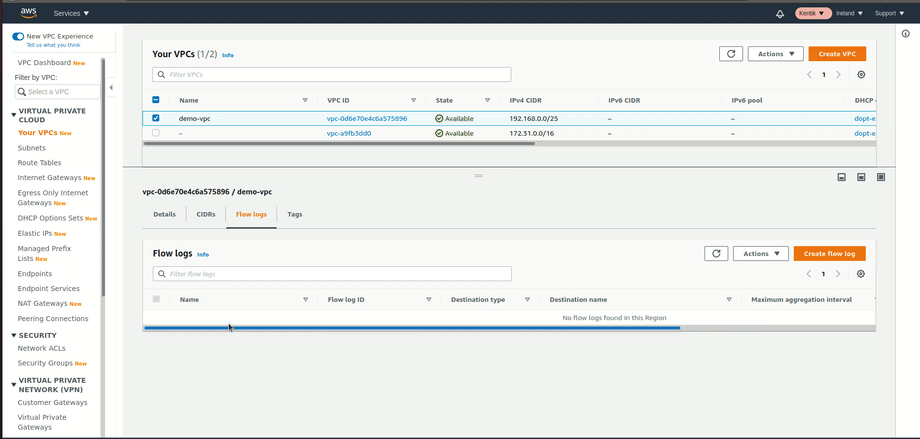

The same applies to S3 buckets, as we can see the list is empty.

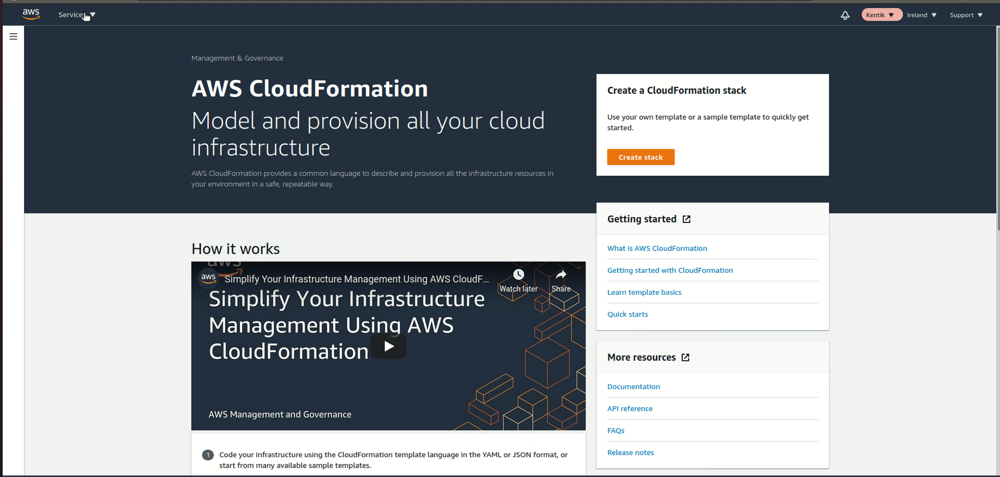

And finally, let's do the same for the IAM role and policies, to make sure we won't be blocked by any existing resources.

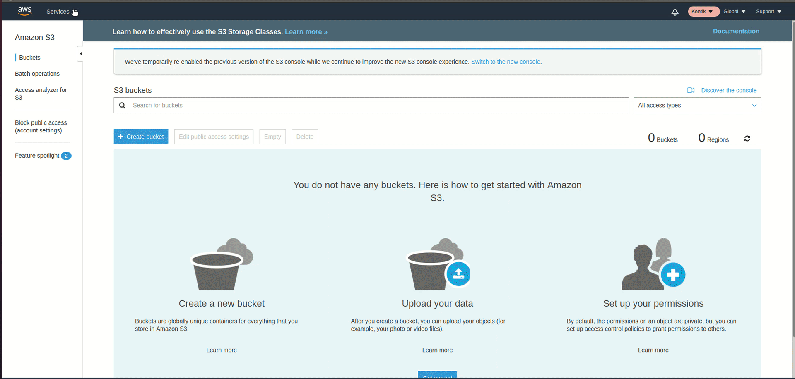

Everything seems clean, so we're good to go!

## Introduce the demo Ansible structure

Inside the demo folder we have the Ansible's demo structure with a single playbook (*main.yml*) and one role. **The purpose of this structure is to imitate the Ansible's setup you may already have in your environment**. Our goal is to integrate the Kentik's Ansible role into this structure.

As you can see, the playbook does not do much, it only makes sure the */tmp/demo\_file* exists.

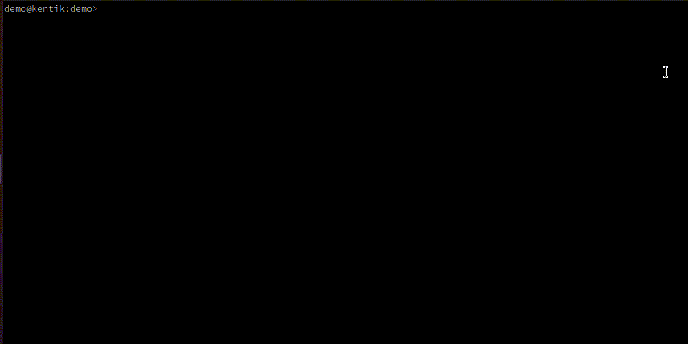

Let's run the playbook to make sure it's working.

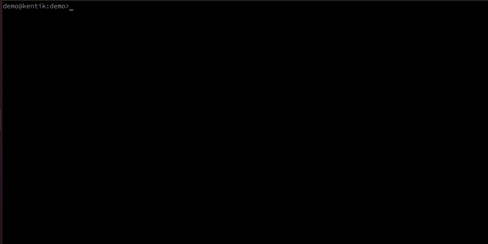

So let's now move to the creme de la creme of this demo and integrate the Kentik's role.

## Integrating Kentik's role into Ansible

We will follow the [Usage instructions](https://github.com/kentik/config-snippets-cloud/tree/master/cloud_AWS/ansible/role#usage) to download and place the role inside the Ansible directory structure.

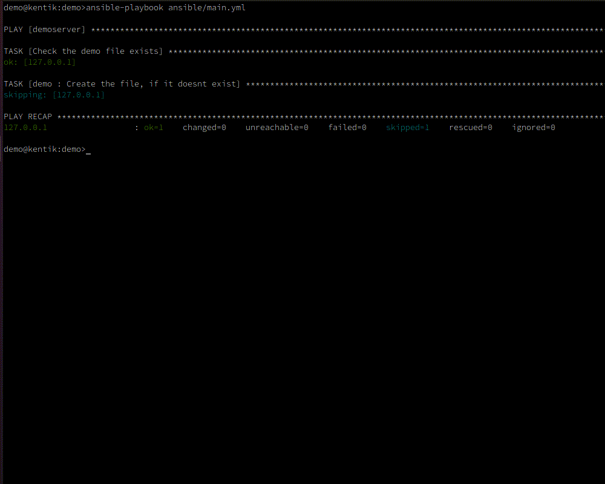

Note, inside the *example* directory you will find a sample playbook. You can also check it [here](https://github.com/kentik/config-snippets-cloud/tree/master/cloud_AWS/ansible/role/examples/single-vpc) without clonning the whole repository.

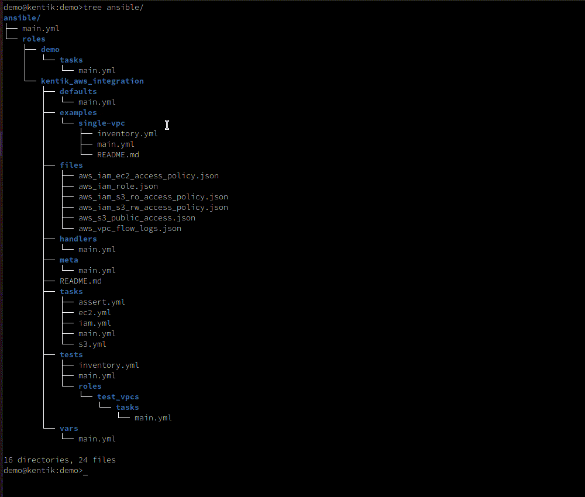

This example may be helpful for understanding how to integrate the role into an existing playbook. Let's follow it now.

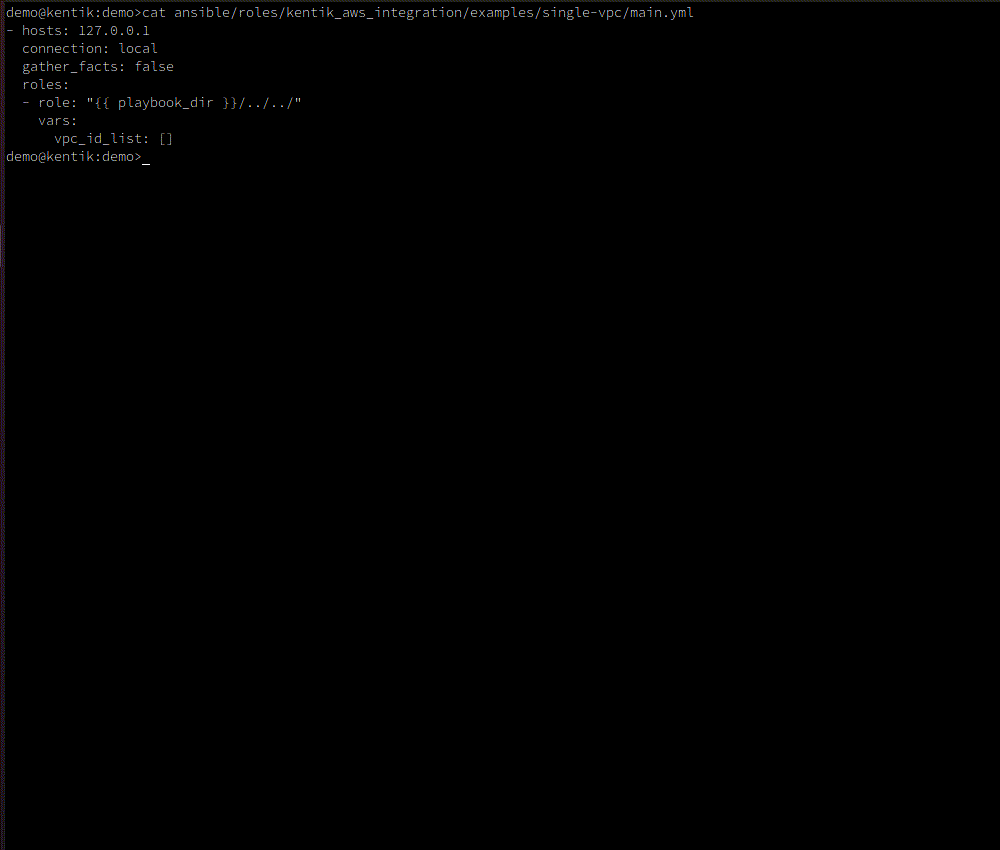

Ok, let's check if we're ready to go by running the playbook. It seems we've failed to populate the *vpc_id_list* variable.

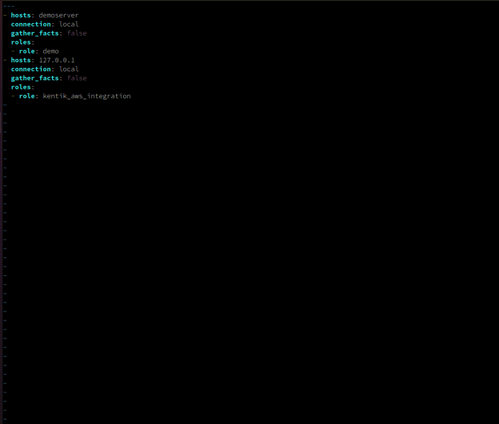

Remember to always check the [Variables section](https://github.com/kentik/config-snippets-cloud/tree/master/cloud_AWS/ansible/role#variables) as some of them may be required to execute the playbook at all.

Ok, so we have to populate the *vpc_id_list* variable with VPC IDs we wish to create the flow logs for.

Let's add some other variables too.

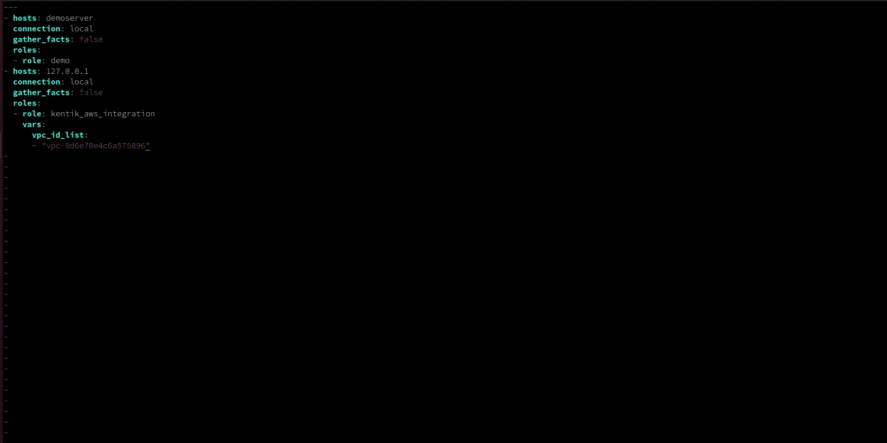

And finally run the playbook. Don't be surprised by the `AWS_PROFILE` variable, as we make some changes on the AWS cloud with this script the access must be configured a priori. Please refer the [AWS documentation](https://docs.aws.amazon.com/cli/latest/userguide/cli-chap-configure.html) if you haven't already done that.
As you can see, at the end of the execution you will be informed of the results - the IAM role and buckets created for you. We will be needing them soon.

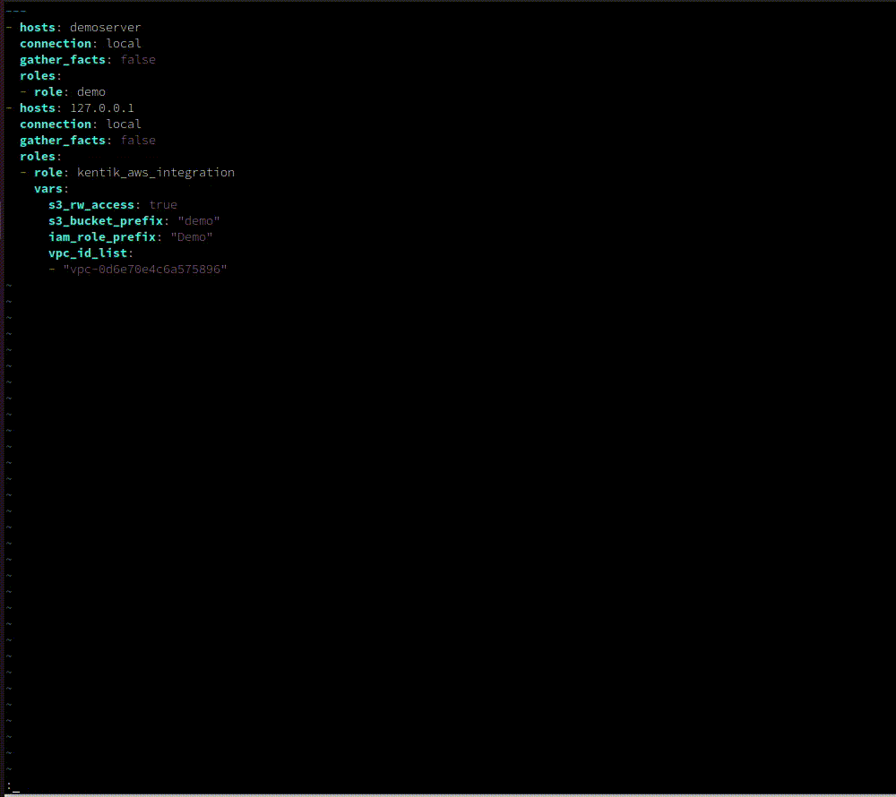

Let's check the AWS resources again starting with the Flow Logs. As you can see, they are in place. Notice an `ACTIVE` status, meaning the configuration is correct and logging is working.

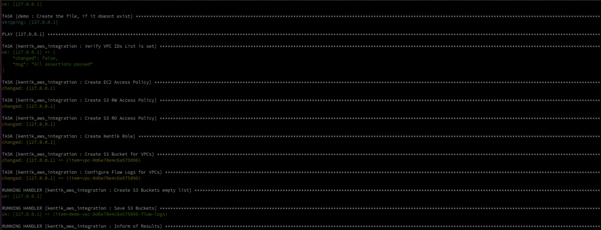

Next verify the IAM policies. Three of them have been just created, one for the EC2 access and two for the S3 access. Note however only the `DemoS3RWAccess` policy is used since we set the `rw_s3_access: true` variable inside the playbook.

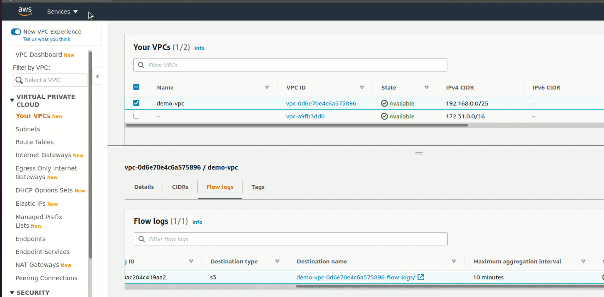

The S3 bucket for our logs is there as well, although it is still empty.

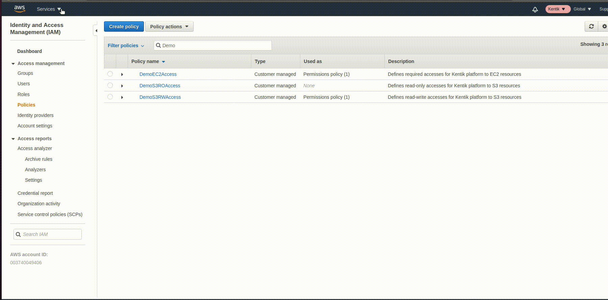

As the last thing we will check the CloudFormation. You may be surprised to see them, however it's not without a good reason. The Ansible lacks modules for both - the S3 bucket public access and more importantly the VPC Flow Logs.
So we could choose to either execute the AWS CLI inside the role or to find out some other way to provide the needed resources. To avoid using any external commands and thus to make our role the first-class citizen of Ansible, we decided to use supoorted CloudFormation module.

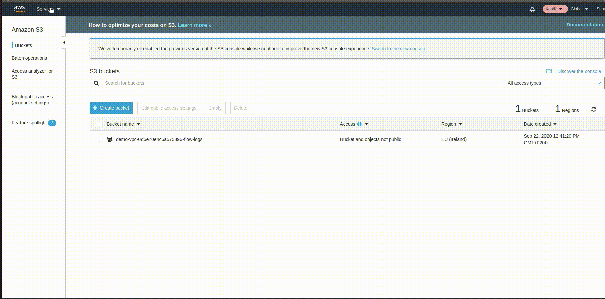

Everything seem to be in place, so let's move to the last stage and onboard the cloud to Kentik. Remember the playbook's output? We will use it now.

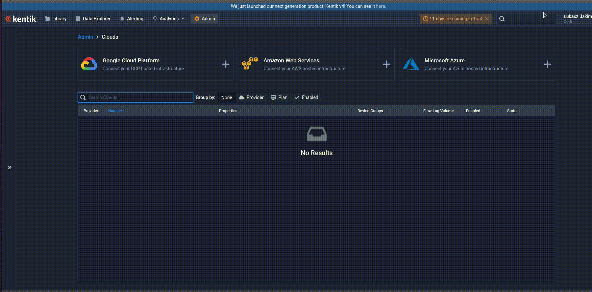

And we're done! Now we have to wait a moment for the Kentik to provision our cloud and start ingest data.
