# Demo

## Verify we're working on a clean setup

First, notice there are no VPC Flow Logs configured yet.

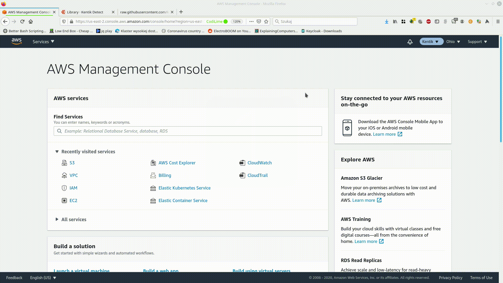

Next, check the S3 buckets. There is no bucket with terraform in name.

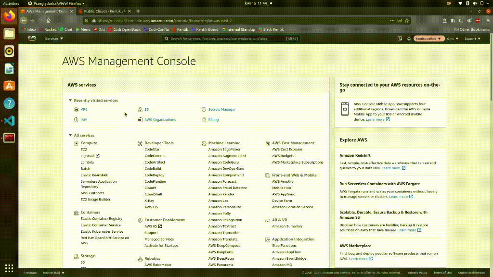

The same applies to IAM role and policies.


Everything seems clean, so we're good to go!

## Prepare terraform code

Let's start with empty directory and create `main.tf` file.

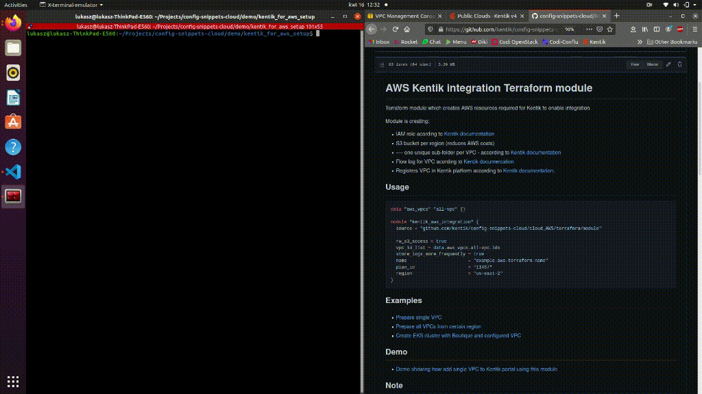

Now when we have basic structure let's update module parameters.

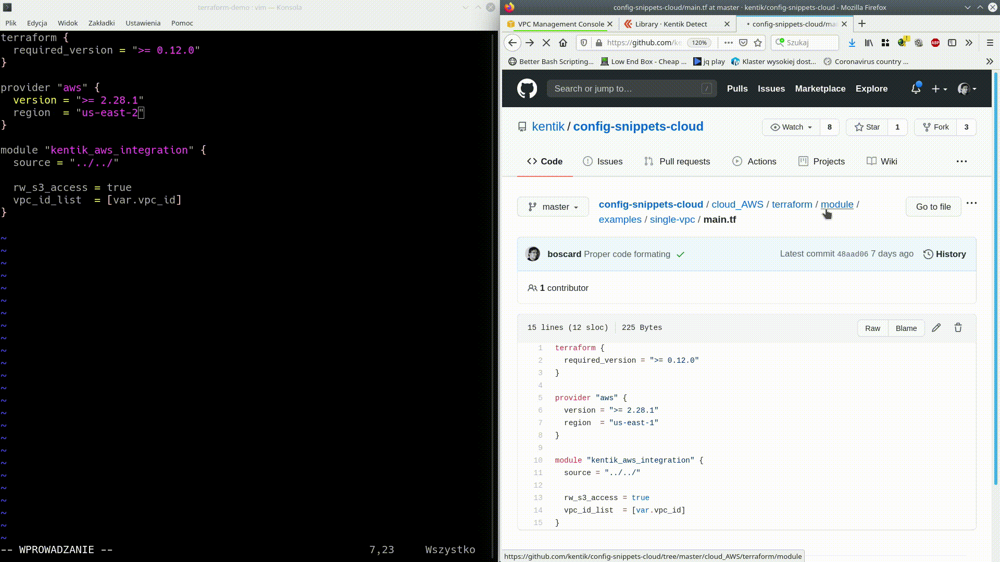

It is important to provide proper source for module. Fortunately we can use modules directly from GitHub.

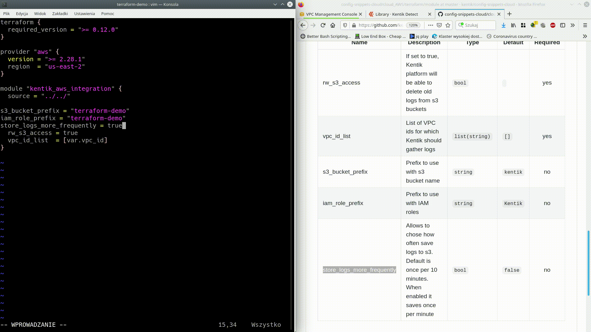

The most important thing is to provide id of VPC we want to configure. This module is able to configure many VPCs at once so parameter is list of strings. Now we are going to provide one VPC id as one element list of strings.

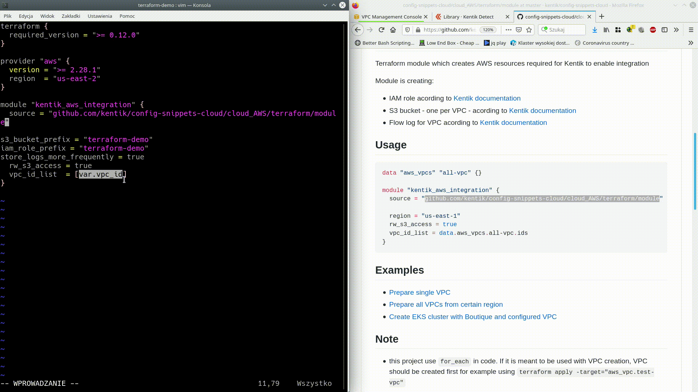

It is useful to have proper output from out code.

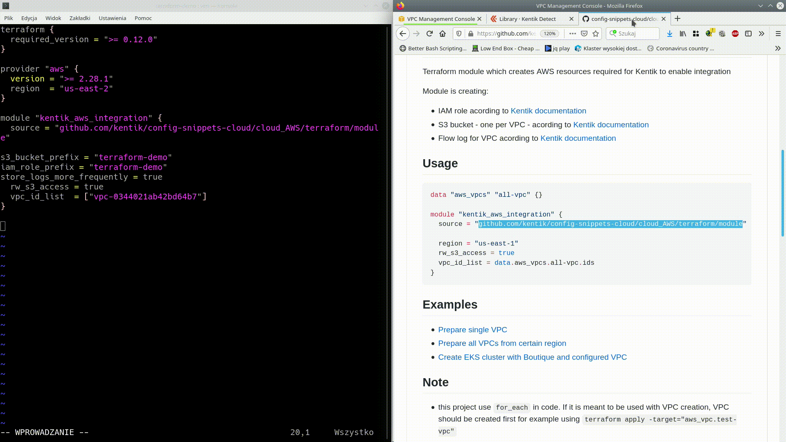

## Execution time

Now when we have code ready, we can execute it!

First we need to test terraform code using.

```
$ terraform init
$ terraform validate
$ terraform plan
```

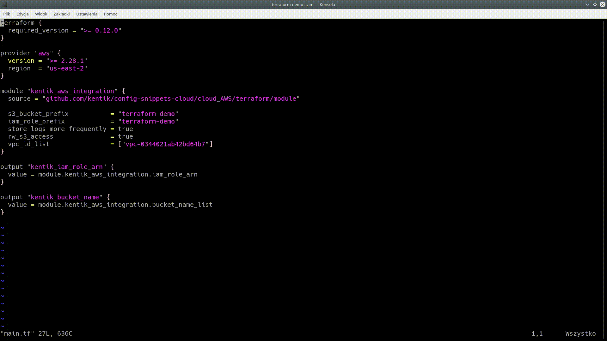

Plan output should always be revised carefully. If everything is OK (and ti should be) then it's time for apply!

```
$ terraform apply
```

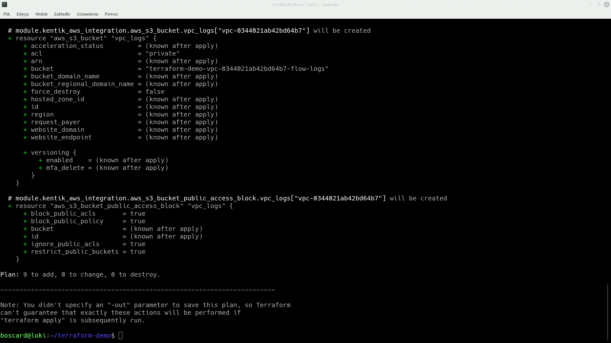

Let's check if we have resources in AWS.

Flow logs for VPC:

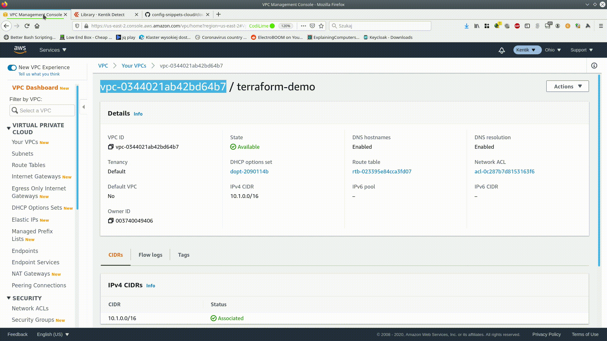

IAM role with permissions:

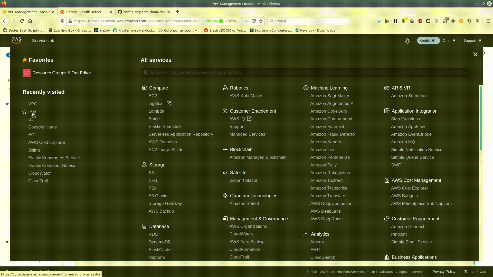

and also S3 bucket for logs storage. Pleas note that it can take few minutes before AWS start saving logs in bucket.

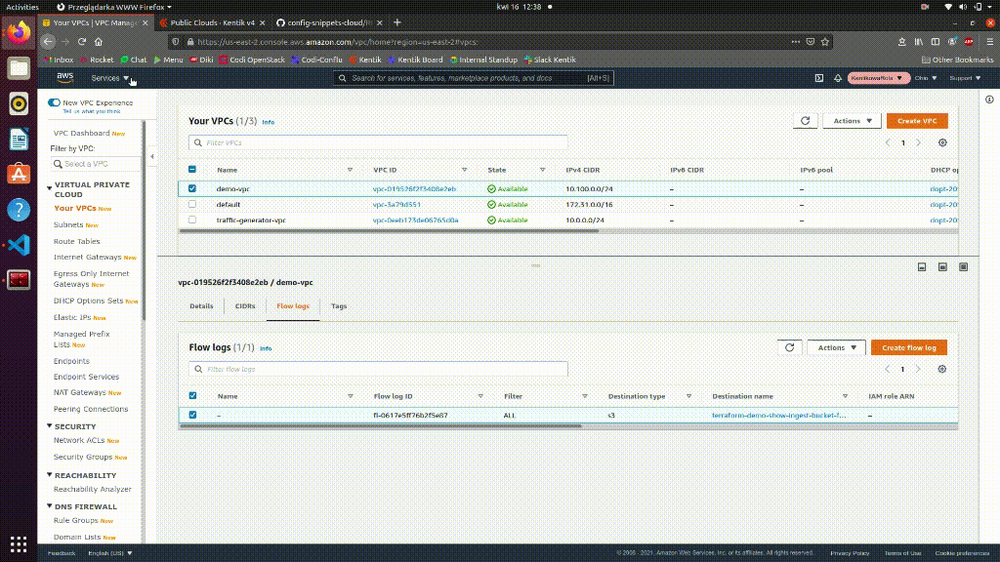

## Now we have everything to register our VPC in https://portal.kentik.com

From terraform output we have all data required to register VPC in Kentik portal. After filling them in form we will be able to track our VPC in portal. We need to remember that it also requires few minutes to pars first logs.

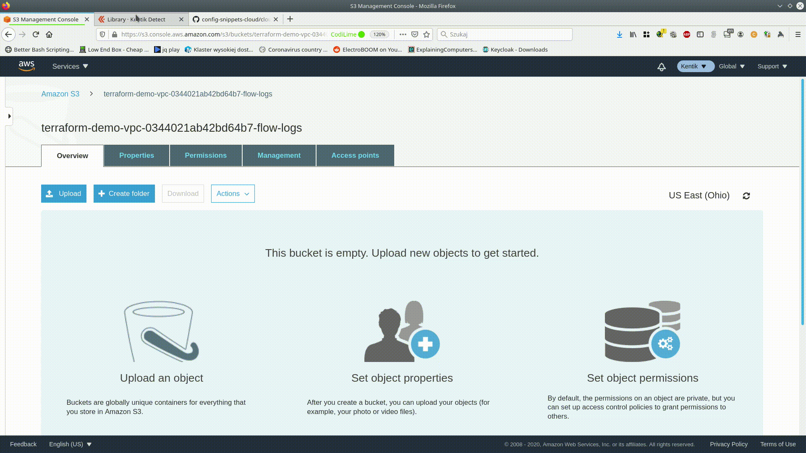

## Whole demo

You can find whole demo also [here](.assets/mp4/KentikTerraformAWSDemo.mp4)

