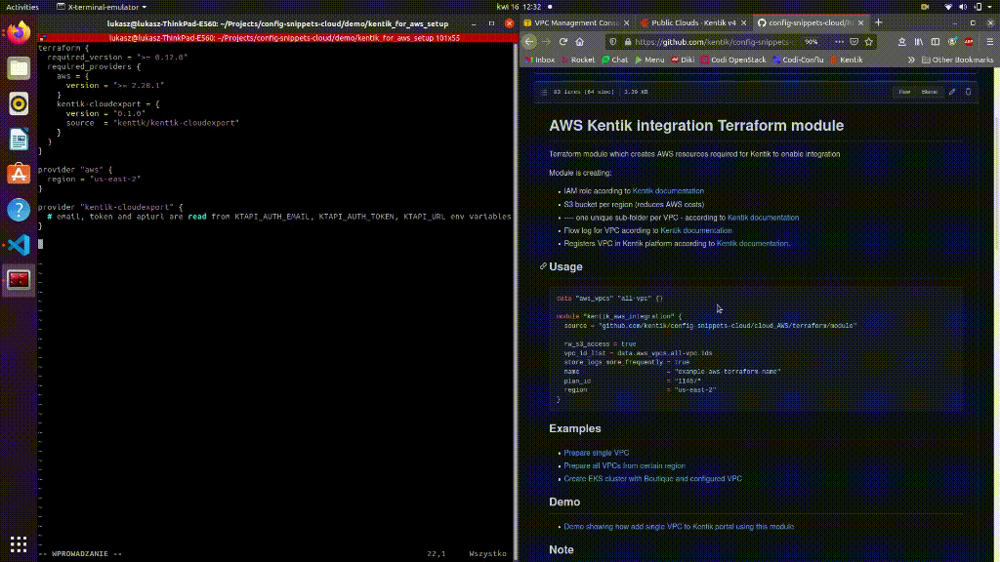

# Demo

## Verify we're working on a clean setup

First, notice there are no VPC Flow Logs configured yet.


Next, check the S3 buckets. There is no bucket with `terraform-demo-show` string in name. It means that our module was not executed.


The same applies to IAM role and policies.


Everything seems clean, so we're good to go!

## Prepare terraform code

Let's start with empty directory, create `main.tf` file and add terraform and providers configuration to this file.


Add module with source parameter. Fortunately we can use modules directly from GitHub.



The most important thing is to provide ID of VPC we want to configure. This module is able to configure many VPCs at once so parameter is list of strings. Now we are going to provide one VPC ID as one element list of strings.


Now let's update rest of module parameters. I set all prefixes and name to `terraform-demo-show` for easier identification.


The whole [main.tf](main.tf) file used in demo

## Execution time

Now when we have code ready, we can execute it!

First we need to test terraform code using.

```bash
terraform init
terraform validate
terraform plan
```


Plan output should always be revised carefully. If everything is OK (and it should be) then it's time for apply!

```bash
terraform apply
```


## Verify results

Now let's check if we have resources in AWS and Kentik Portal created.

Flow logs for VPC:


S3 bucket for logs storage. Please note that it can take few minutes before AWS start saving logs in bucket.


and also IAM role with permissions:


Finally check if cloud export item was created in Kentik Portal:


